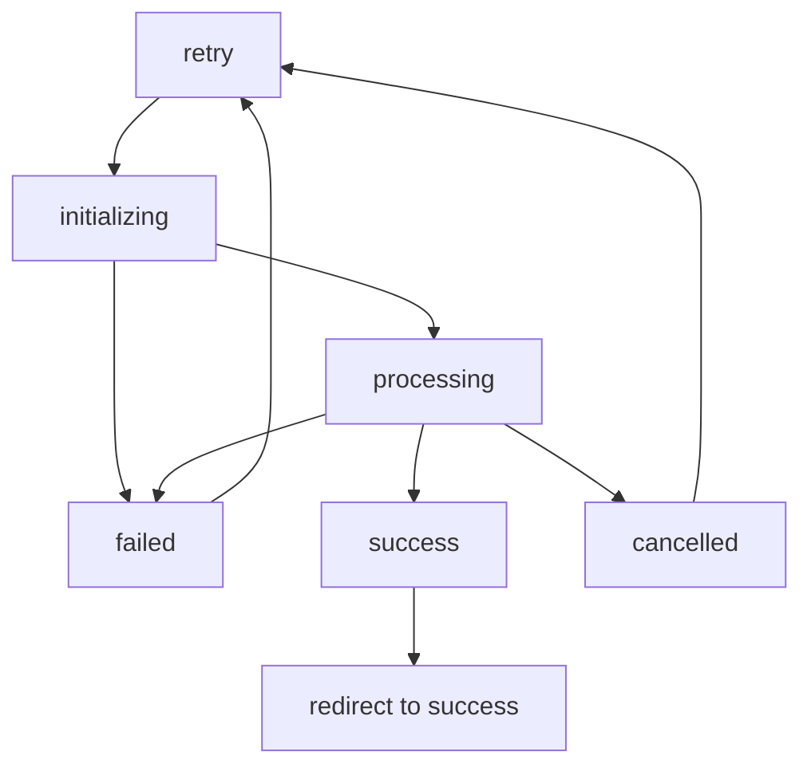

# Payment Dismissal and Cancellation Handling

## Overview

This document explains how the Ingoma Tours application handles scenarios where users dismiss payment forms, cancel payments, or encounter payment failures. The system ensures data consistency and provides a smooth user experience even when payments are interrupted.

## 🚨 Previous Issues (Now Fixed)

### Before the Fix:

1. **Stuck Processing State**: Form remained in "Processing..." state indefinitely
2. **Booking Status Inconsistency**: Bookings stuck in `PROCESSING` payment status
3. **No Retry Mechanism**: Users couldn't retry payments after dismissal
4. **Poor UX**: No clear feedback about what happened

### After the Fix:

1. **Smart State Management**: Proper handling of all payment states
2. **Automatic Status Reset**: Bookings reset to `PENDING` when payment cancelled
3. **Retry Functionality**: Users can retry payments seamlessly
4. **Clear User Feedback**: Informative messages and visual indicators

## 🔄 Payment State Flow

### Payment States:

- `idle` - Ready to start payment
- `initializing` - Setting up payment with IremboPay
- `processing` - Payment modal is open, waiting for user action
- `failed` - Payment failed due to technical error
- `cancelled` - User dismissed/cancelled payment
- `success` - Payment completed successfully

### State Transitions:



## 🛠 Implementation Details

### 1. Enhanced PaymentButton Component

**Key Features:**

- **State Management**: Tracks payment state throughout the process
- **Timeout Detection**: 30-second timeout to detect modal dismissal
- **Automatic Cleanup**: Resets booking status when payment cancelled
- **Retry Logic**: Allows users to retry payments with fresh initialization
- **Visual Feedback**: Different button states and messages for each scenario

**Code Example:**

```typescript
const [paymentState, setPaymentState] = useState<PaymentState>('idle');
const [retryCount, setRetryCount] = useState(0);

// Timeout to detect modal dismissal
const modalTimeout = setTimeout(() => {
  if (paymentState === 'processing') {
    setPaymentState('cancelled');
    toast.error('Payment was cancelled. You can try again when ready.');
    resetBookingStatus();
  }
}, 30000);
```

### 2. Booking Status Reset API

**Endpoint:** `POST /api/bookings/[id]/reset-payment`

**Purpose:** Resets booking payment status from `PROCESSING` back to `PENDING`

**Security Features:**

- Only resets bookings in `PROCESSING` state
- Creates audit log for tracking
- Validates booking existence and permissions

**Response Example:**

```json
{
  "success": true,
  "message": "Booking payment status reset successfully",
  "paymentStatus": "PENDING"
}
```

### 3. Enhanced Booking Confirmation Page

**Improvements:**

- **Status Indicators**: Visual badges showing payment and booking status
- **Conditional Payment Section**: Different UI based on payment status
- **Clear Instructions**: Explanatory text about deposit requirements
- **Better Navigation**: Improved button layout and labeling

## 📊 User Experience Scenarios

### Scenario 1: User Dismisses Payment Modal

1. User clicks "Pay Now"
2. Payment initializes successfully
3. IremboPay modal opens
4. User closes modal or clicks outside
5. **System Response:**
   - Detects dismissal via timeout (30s)
   - Sets state to `cancelled`
   - Shows message: "Payment was cancelled. You can try again when ready."
   - Resets booking status to `PENDING`
   - Button changes to "Try Again"

### Scenario 2: Payment Technical Failure

1. User clicks "Pay Now"
2. Payment initialization fails OR IremboPay returns error
3. **System Response:**
   - Sets state to `failed`
   - Shows error message with specific details
   - Resets booking status to `PENDING`
   - Button changes to "Retry Payment"

### Scenario 3: Network Issues During Payment

1. User clicks "Pay Now"
2. Network request fails during initialization
3. **System Response:**
   - Catches error in `initializePayment()`
   - Sets state to `failed`
   - Shows message: "Payment initialization failed"
   - Booking status remains `PENDING` (never changed)
   - Button shows "Retry Payment"

### Scenario 4: Successful Payment Recovery

1. User encounters payment failure
2. Clicks "Retry Payment"
3. **System Response:**
   - Resets state to `idle`
   - Clears previous invoice number (forces re-initialization)
   - Increments retry counter
   - Starts fresh payment process

## 🔍 Monitoring and Debugging

### Audit Logs

Every payment status change is logged:

```typescript
await createAuditLog({
  action: 'PAYMENT_RESET',
  metadata: {
    bookingId: booking.id,
    previousPaymentStatus: booking.paymentStatus,
    newPaymentStatus: PaymentStatus.PENDING,
    customerEmail: booking.customerEmail,
    reason: 'Payment cancelled or dismissed by user',
  },
});
```

### Error Tracking

- All payment errors are logged with full context
- Retry attempts are tracked and limited
- Support contact offered after multiple failures

### User Feedback

- **Success**: "Payment completed successfully! Your booking has been confirmed."
- **Cancelled**: "Payment was cancelled. You can try again when ready."
- **Failed**: "Payment failed. Please try again or contact support."
- **Multiple Failures**: "Having trouble? Contact support for assistance."

## 🔒 Security Considerations

### Data Consistency

- Booking status always reflects actual payment state
- No orphaned `PROCESSING` bookings
- Audit trail for all status changes

### User Privacy

- No sensitive payment data logged
- Error messages don't expose internal details
- Payment tokens/IDs properly cleared on failure

### Rate Limiting

- Retry attempts tracked and limited
- Support contact offered for persistent issues
- Prevents abuse of payment initialization

## 📱 Mobile Considerations

### Touch Interactions

- Large, clear buttons for different states
- Visual feedback for all interactions
- Accessible color coding for status indicators

### Network Reliability

- Robust error handling for poor connections
- Clear messaging about network issues
- Retry mechanisms for temporary failures

## 🧪 Testing Scenarios

### Manual Testing Checklist:

1. **Normal Payment Flow**

   - [ ] Click "Pay Now" → Modal opens
   - [ ] Complete payment → Success page
   - [ ] Booking status updates to `CONFIRMED`

2. **Payment Dismissal**

   - [ ] Click "Pay Now" → Modal opens
   - [ ] Close modal → Button shows "Try Again"
   - [ ] Click "Try Again" → Fresh modal opens

3. **Payment Failure**

   - [ ] Simulate network error during initialization
   - [ ] Button shows "Retry Payment"
   - [ ] Retry works correctly

4. **Multiple Retries**

   - [ ] Fail payment 3+ times
   - [ ] Support contact message appears
   - [ ] Retry still functional

5. **Status Persistence**
   - [ ] Refresh page during various states
   - [ ] Status correctly restored
   - [ ] No stuck states

## 🚀 Future Enhancements

### Planned Improvements:

1. **Webhook Timeout Handling**: Better handling of delayed webhook responses
2. **Payment Method Selection**: Multiple payment options with different flows
3. **Partial Payment Recovery**: Resume payments from where they left off
4. **Real-time Status Updates**: WebSocket-based status synchronization
5. **Advanced Analytics**: Track payment abandonment patterns

### Performance Optimizations:

1. **Debounced Retry Logic**: Prevent rapid-fire retry attempts
2. **Intelligent Timeout Adjustment**: Dynamic timeout based on payment method
3. **Background Status Polling**: Verify payment status independently
4. **Cached Payment Initialization**: Reuse valid payment sessions

---

## 📞 Support Information

If users encounter persistent payment issues:

- **Contact Page**: `/contact`
- **Email**: Available through contact form
- **Phone**: Provided on contact page
- **Documentation**: This guide and troubleshooting steps

The system is designed to be resilient and user-friendly, ensuring that temporary payment issues don't result in lost bookings or poor user experience.
