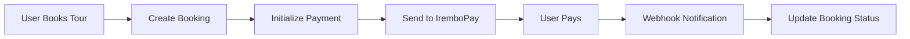

# 💳 Payment Integration

## Overview

The Ingoma Tours platform integrates with **IremboPay** for payment processing. IremboPay is a Rwandan payment gateway that supports multiple payment methods including mobile money (MTN MoMo, Airtel Money), bank transfers, and card payments.

⚠️ **CRITICAL**: Based on the [official IremboPay documentation](https://irembopay.gitbook.io/irembopay-api-docs/apis/invoice/openapi), products and payment accounts must exist in your merchant dashboard before they can be used in API calls.

## Product Strategy

### Approach 1: Tour-Specific Products (Recommended)

- Each tour package gets its own product in IremboPay
- Product code format: `TOUR-{tourPackageId}`
- Provides detailed tracking and reporting
- Better for analytics and revenue tracking

### Approach 2: Generic Product (Simpler Setup)

- One product for all tour bookings
- Set environment variable: `IREMBO_PRODUCT_CODE=TOUR-BOOKING`
- Simpler to set up but less detailed tracking

## Setup Instructions

### Option 1: Tour-Specific Products

1. **Run the setup script to see your tour packages:**

   ```bash
   npx tsx scripts/setup-irembopay-products.ts
   ```

2. **Create products in IremboPay dashboard:**

   - Log into your IremboPay merchant dashboard
   - Navigate to Products/Services section
   - For each tour package, create a product with:
     - Product Code: `TOUR-{tourPackageId}` (exactly as shown by the script)
     - Product Name: Tour package title
     - Price: Tour package price in RWF

3. **Test the integration:**
   - Try booking a tour
   - Verify the payment process works

### Option 2: Generic Product (Quick Setup)

1. **Create one product in IremboPay dashboard:**

   - Product Code: `TOUR-BOOKING`
   - Product Name: `Tour Booking`
   - Price: Can be any amount (will be overridden by actual booking amount)

2. **Add environment variable:**

   ```bash
   IREMBO_PRODUCT_CODE=TOUR-BOOKING
   ```

3. **Test the integration**

## Environment Variables

```bash
# Required
IREMBO_SECRET_KEY=your_irembopay_secret_key
IREMBO_PAYMENT_ACCOUNT_ID=your_payment_account_identifier

# Optional - for generic product approach
IREMBO_PRODUCT_CODE=TOUR-BOOKING

# App URL for callbacks
NEXT_PUBLIC_APP_URL=https://yourdomain.com
```

## API Endpoints

### 1. Initialize Payment

- **Endpoint:** `POST /api/payments/initialize`
- **Payload:**
  ```json
  {
    "bookingId": "booking_id_here"
  }
  ```
- **Response:**
  ```json
  {
    "invoiceId": "invoice_number",
    "paymentUrl": "checkout_url"
  }
  ```

### 2. Payment Webhook

- **Endpoint:** `POST /api/payments/webhook`
- **Purpose:** Handles IremboPay payment notifications

## Data Flow



## Error Handling

### Common Errors and Solutions

#### 1. PRODUCT_NOT_FOUND

**Error:** Tour package product code doesn't exist in IremboPay
**Solutions:**

- Create the specific product in your IremboPay dashboard using the exact code format
- OR switch to generic product approach
- OR contact IremboPay support for dynamic product creation

#### 2. PAYMENT_ACCOUNT_NOT_FOUND

**Error:** Payment account identifier is incorrect
**Solutions:**

- Check your IremboPay dashboard for the correct payment account identifier
- Update the `IREMBO_PAYMENT_ACCOUNT_ID` environment variable

#### 3. Authentication Errors (401)

**Error:** Invalid API credentials
**Solutions:**

- Verify `IREMBO_SECRET_KEY` is correct
- Ensure you're using the correct API version (v2)
- Check if your IremboPay account is active

## Payment Verification

The system automatically verifies payments using IremboPay's invoice status endpoint:

- Payment status is checked via webhook
- Manual verification available via the verify payment endpoint
- Booking status is updated accordingly

## Testing

### Sandbox Environment

- Use IremboPay sandbox for testing
- API URL: `https://api.sandbox.irembopay.com`
- Test payment methods available in sandbox

### Production Checklist

- [ ] Products created in IremboPay dashboard
- [ ] Environment variables configured
- [ ] Webhook endpoint accessible
- [ ] SSL certificate valid
- [ ] Payment flow tested end-to-end

## Support

If you encounter issues:

1. Check the console logs for detailed error messages
2. Verify environment variables are set correctly
3. Ensure products exist in your IremboPay dashboard
4. Contact IremboPay support for account-specific issues

## Security Notes

- API keys are never exposed to frontend
- Webhook signatures should be verified (implementation ready)
- Payment data is logged with sensitive information redacted
- Secure HTTPS required for production webhooks

## 🏗️ Payment Architecture

### Payment Flow

```
1. User submits booking form
2. System creates pending booking
3. Payment initialization via IremboPay API
4. User redirected to IremboPay payment page
5. User completes payment
6. IremboPay sends webhook notification
7. System verifies payment
8. Booking status updated
9. Confirmation email sent
```

### IremboPay Integration Components

```
lib/services/
├── irembopay.ts           # IremboPay payment service
├── real-time-monitoring.ts # Payment event broadcasting
└── notifications.ts       # Payment notifications

app/api/payments/
├── initialize/route.ts    # Payment initialization
└── webhook/route.ts       # Payment webhook handler

components/payment/
├── payment-button.tsx     # Payment trigger component
├── payment-confirmation.tsx # Payment result display
├── payment-toast.tsx      # Payment notifications
└── error-boundary.tsx     # Payment error handling
```

## 🔧 IremboPay Service Implementation

### Core Configuration

```typescript
// lib/services/irembopay.ts
const IREMBOPAY_API_URL = 'https://api.sandbox.irembopay.com';
const API_SECRET = process.env.IREMBO_SECRET_KEY;
const PAYMENT_ACCOUNT_IDENTIFIER = process.env.IREMBO_PAYMENT_ACCOUNT_ID;
const PRODUCT_CODE = process.env.IREMBO_PRODUCT_CODE;

// Authentication headers
function generateAuthHeaders() {
  return {
    'Content-Type': 'application/json',
    'irembopay-secretKey': API_SECRET!,
    'X-API-Version': '2',
    Accept: 'application/json',
  };
}

// Create payment invoice
export async function createPaymentInvoice(paymentData) {
  const requestBody = {
    transactionId: paymentData.reference,
    paymentAccountIdentifier: PAYMENT_ACCOUNT_IDENTIFIER,
    customer: {
      email: paymentData.customerEmail,
      phoneNumber: paymentData.customerPhone,
      name: paymentData.customerName,
    },
    paymentItems: [
      {
        unitAmount: paymentData.amount,
        quantity: 1,
        code: PRODUCT_CODE,
      },
    ],
    description: paymentData.description,
    expiryAt: new Date(Date.now() + 24 * 60 * 60 * 1000).toISOString(),
    language: 'EN',
  };

  const response = await fetch(`${IREMBOPAY_API_URL}/payments/invoices`, {
    method: 'POST',
    headers: generateAuthHeaders(),
    body: JSON.stringify(requestBody),
  });

  const responseData = await response.json();

  return {
    invoiceId: responseData.data.invoiceNumber,
    paymentUrl: responseData.data.paymentLinkUrl,
    reference: responseData.data.transactionId,
    status: responseData.data.paymentStatus?.toLowerCase(),
  };
}
```

### Payment Verification

```typescript
export async function verifyPayment(invoiceReference: string) {
  const response = await fetch(
    `${IREMBOPAY_API_URL}/payments/invoices/${invoiceReference}`,
    {
      method: 'GET',
      headers: generateAuthHeaders(),
    }
  );

  const responseData = await response.json();

  return {
    success: responseData.success,
    status: responseData.data?.paymentStatus?.toLowerCase(),
    isPaid: responseData.data?.paymentStatus === 'PAID',
    amount: responseData.data?.amount,
    reference: responseData.data?.transactionId,
  };
}
```

## 🌐 Payment API Endpoints

### Payment Initialization

```typitten
// app/api/payments/initialize/route.ts
export async function POST(request: Request) {
  const { bookingId } = await request.json();

  const booking = await prisma.booking.findUnique({
    where: { id: bookingId },
    include: { tourPackage: true },
  });

  const paymentData = {
    amount: Number(booking.totalAmount),
    currency: 'RWF',
    reference: booking.id,
    customerEmail: booking.customerEmail,
    customerName: booking.customerName,
    customerPhone: booking.phone,
    description: `Tour booking: ${booking.tourPackage.title}`,
    callbackUrl: `${process.env.NEXT_PUBLIC_APP_URL}/api/payments/webhook`,
    returnUrl: `${process.env.NEXT_PUBLIC_APP_URL}/bookings/${booking.id}/success`,
  };

  const { invoiceId, paymentUrl } = await createPaymentInvoice(paymentData);

  return NextResponse.json({ invoiceId, paymentUrl });
}
```

### Payment Webhook Handler

```typescript
// app/api/payments/webhook/route.ts
export async function POST(request: Request) {
  const body = await request.text();
  const signature = request.headers.get('x-irembopay-signature');

  // Verify webhook signature
  if (!verifyIremboWebhookSignature(body, signature)) {
    return NextResponse.json({ error: 'Invalid signature' }, { status: 401 });
  }

  const data = JSON.parse(body);

  if (data.paymentStatus === 'PAID') {
    // Update booking status
    await prisma.booking.update({
      where: { id: data.transactionId },
      data: {
        status: 'CONFIRMED',
        paymentStatus: 'PAID',
        paymentReference: data.paymentReference,
      },
    });

    // Send confirmation email
    await sendBookingConfirmation(data.transactionId);
  }

  return NextResponse.json({ received: true });
}
```

## 🎯 Payment Components

### Payment Button

```typescript
// components/payment/payment-button.tsx
interface PaymentButtonProps {
  bookingId: string;
  amount: number;
  onSuccess?: () => void;
  onError?: (error: string) => void;
}

export function PaymentButton({
  bookingId,
  amount,
  onSuccess,
  onError,
}: PaymentButtonProps) {
  const [isLoading, setIsLoading] = useState(false);

  const handlePayment = async () => {
    setIsLoading(true);

    try {
      // Initialize payment
      const response = await fetch('/api/payments/initialize', {
        method: 'POST',
        headers: { 'Content-Type': 'application/json' },
        body: JSON.stringify({ bookingId }),
      });

      if (!response.ok) {
        throw new Error('Failed to initialize payment');
      }

      const { paymentUrl } = await response.json();

      // Redirect to IremboPay payment page
      window.location.href = paymentUrl;
    } catch (error) {
      const message = error instanceof Error ? error.message : 'Payment failed';
      toast.error(message);
      onError?.(message);
    } finally {
      setIsLoading(false);
    }
  };

  return (
    <PaymentErrorBoundary>
      <Button
        onClick={handlePayment}
        disabled={isLoading}
        className='w-full bg-green-600 hover:bg-green-700'
      >
        {isLoading ? (
          <>
            <Loader2 className='mr-2 h-4 w-4 animate-spin' />
            Initializing Payment...
          </>
        ) : (
          `Pay $${amount.toLocaleString()}`
        )}
      </Button>
    </PaymentErrorBoundary>
  );
}
```

### Payment Confirmation

```typescript
// components/payment/payment-confirmation.tsx
interface PaymentConfirmationProps {
  status: 'success' | 'failed' | 'pending';
  bookingId?: string;
  amount?: number;
}

export function PaymentConfirmation({
  status,
  bookingId,
  amount,
}: PaymentConfirmationProps) {
  const router = useRouter();

  const getStatusConfig = () => {
    switch (status) {
      case 'success':
        return {
          icon: CheckCircle,
          title: 'Payment Successful!',
          message: 'Your booking has been confirmed.',
          color: 'text-green-600',
          bgColor: 'bg-green-50',
        };
      case 'failed':
        return {
          icon: XCircle,
          title: 'Payment Failed',
          message: 'Your payment could not be processed.',
          color: 'text-red-600',
          bgColor: 'bg-red-50',
        };
      default:
        return {
          icon: Loader2,
          title: 'Processing Payment...',
          message: 'Please wait while we confirm your payment.',
          color: 'text-blue-600',
          bgColor: 'bg-blue-50',
        };
    }
  };

  const config = getStatusConfig();
  const Icon = config.icon;

  return (
    <div className={`p-8 rounded-lg ${config.bgColor} text-center`}>
      <Icon className={`mx-auto h-16 w-16 ${config.color} mb-4`} />
      <h2 className='text-2xl font-bold mb-2'>{config.title}</h2>
      <p className='text-gray-600 mb-6'>{config.message}</p>

      {amount && (
        <p className='text-lg font-semibold mb-4'>
          Amount: ${amount.toLocaleString()}
        </p>
      )}

      <div className='flex gap-4 justify-center'>
        {status === 'success' && bookingId && (
          <Button asChild>
            <Link href={`/bookings/${bookingId}`}>View Booking Details</Link>
          </Button>
        )}

        {status === 'failed' && (
          <Button variant='outline' onClick={() => router.back()}>
            Try Again
          </Button>
        )}

        <Button variant='ghost' asChild>
          <Link href='/'>Return Home</Link>
        </Button>
      </div>
    </div>
  );
}
```

## 🔒 Security Measures

### Webhook Verification

```typescript
function verifyIremboWebhookSignature(
  body: string,
  signature: string
): boolean {
  const expectedSignature = createHmac(
    'sha256',
    process.env.IREMBOPAY_WEBHOOK_SECRET!
  )
    .update(signature + body)
    .digest('hex');

  return expectedSignature === signature;
}
```

### Amount Validation

```typescript
function validatePaymentAmount(
  booking: Booking,
  webhookAmount: number
): boolean {
  const expectedAmount = Number(booking.totalAmount);
  const tolerance = 0.01; // Allow 1 cent tolerance for floating point

  return Math.abs(expectedAmount - webhookAmount) <= tolerance;
}
```

### Country Code Mapping

```typescript
function getCountryCode(countryName?: string): string {
  const countryMap: Record<string, string> = {
    'United States': 'US',
    'United Kingdom': 'GB',
    Canada: 'CA',
    Uganda: 'UG',
    Kenya: 'KE',
    Tanzania: 'TZ',
    // Add more mappings as needed
  };

  return countryMap[countryName || ''] || 'UG'; // Default to Uganda
}
```

## 📊 Payment Analytics

### Payment Event Tracking

```typescript
// Track payment events
await createAuditLog({
  action: 'PAYMENT_INITIALIZED',
  metadata: {
    bookingId,
    amount,
    customerEmail,
    invoiceId,
  },
});
```

### Payment Reporting

```typescript
export async function getPaymentMetrics(dateRange: DateRange) {
  const payments = await prisma.paymentEvent.findMany({
    where: {
      createdAt: {
        gte: dateRange.start,
        lte: dateRange.end,
      },
    },
    include: {
      booking: {
        include: {
          tourPackage: true,
        },
      },
    },
  });

  return {
    totalRevenue: payments
      .filter((p) => p.event === 'PAYMENT_SUCCESS')
      .reduce((sum, p) => sum + Number(p.booking.totalAmount), 0),
    successfulPayments: payments.filter((p) => p.event === 'PAYMENT_SUCCESS')
      .length,
    failedPayments: payments.filter((p) => p.event === 'PAYMENT_FAILED').length,
    averageOrderValue: calculateAverageOrderValue(payments),
  };
}
```

## 🔧 Environment Configuration

### Required Environment Variables

```bash
# IremboPay Configuration
IREMBO_SECRET_KEY="test_sk_..."
IREMBO_PAYMENT_ACCOUNT_ID="TST-RWF"
IREMBO_PRODUCT_CODE="TOUR-BOOKING"

# Application URLs
NEXT_PUBLIC_APP_URL=https://yourdomain.com

# Webhook Security
IREMBOPAY_WEBHOOK_SECRET=your_webhook_secret

# Email Notifications
ADMIN_EMAIL=admin@yourdomain.com
```

## 🚀 Testing

### Payment Testing

```typescript
// Test payment initialization
async function testPaymentInit() {
  const mockBooking = {
    id: 'test-booking-id',
    totalAmount: 100.0,
    customerEmail: 'test@example.com',
    customerName: 'John Doe',
    tourPackage: { title: 'Test Tour' },
  };

  const result = await createPaymentInvoice({
    amount: 100,
    currency: 'RWF',
    reference: mockBooking.id,
    customerEmail: mockBooking.customerEmail,
    customerName: mockBooking.customerName,
    description: `Tour booking: ${mockBooking.tourPackage.title}`,
    callbackUrl: 'https://yourdomain.com/api/payments/webhook',
    returnUrl: 'https://yourdomain.com/payment/success',
  });

  console.log('Payment URL:', result.paymentUrl);
}
```

### Webhook Testing

Use tools like ngrok to expose your local webhook endpoint:

```bash
ngrok http 3000
# Use the ngrok URL for webhook configuration
```

---

This payment integration provides a secure, robust payment processing system with comprehensive error handling, real-time updates, and detailed analytics for the tour booking platform.
